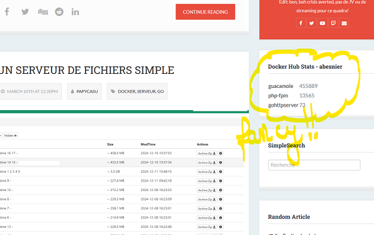

# Docker Hub Pulls Plugin

The **Docker Hub Pulls** Plugin is an extension for [Grav CMS](https://github.com/getgrav/grav). It retrieves pull count for Docker images hosted by Docker Hub for a configured user.




## Installation

Installing the Docker Hub Pulls plugin can be done in one of three ways: The GPM (Grav Package Manager) installation method lets you quickly install the plugin with a simple terminal command, the manual method lets you do so via a zip file, and the admin method lets you do so via the Admin Plugin.

### GPM Installation (Preferred but only when the plugin will be approved)

To install the plugin via the [GPM](https://learn.getgrav.org/cli-console/grav-cli-gpm), through your system's terminal (also called the command line), navigate to the root of your Grav-installation, and enter:

    bin/gpm install docker-hub-pulls

This will install the Docker Hub Pulls plugin into your `/user/plugins`-directory within Grav. Its files can be found under `/your/site/grav/user/plugins/docker-hub-pulls`.

### Manual Installation (to be used until the plugin is approved!)

To install the plugin manually, download the zip-version of this repository and unzip it under `/your/site/grav/user/plugins`. Then rename the folder to `docker-hub-pulls`. You can find these files on [GitHub](https://github.com//grav-plugin-docker-hub-pulls) or via [GetGrav.org](https://getgrav.org/downloads/plugins).

You should now have all the plugin files under

    /your/site/grav/user/plugins/docker-hub-pulls
	
> NOTE: This plugin is a modular component for Grav which may require other plugins to operate, please see its [blueprints.yaml-file on GitHub](https://github.com//grav-plugin-docker-hub-pulls/blob/master/blueprints.yaml).

### Admin Plugin

If you use the Admin Plugin, you can install the plugin directly by browsing the `Plugins`-menu and clicking on the `Add` button.

## Configuration

Before configuring this plugin, you should copy the `user/plugins/docker-hub-pulls/docker-hub-pulls.yaml` to `user/config/plugins/docker-hub-pulls.yaml` and only edit that copy.

Here is the default configuration and an explanation of available options:

```yaml
enabled: true or false
username: MANDATORY - your Docker Hub username
images: a bullet list of images you want to get the pull count of. If none are specified, all your images will be retrieved from the Docker Hub api.
limit: if you have uploaded many images to Docker Hub, you can limit how many images you will get the pull count of (note that the list of images will be 100% depend on Docker Hub API)
orderby: valid entried are none, pulls, name. 
```
None: results will be displayed as per Docker Hub API returned values. Pulls (default): order by pull count descending. Name: Order by image name ascending.

> Note: images must be listed in the form of a YAML List:
> ```yaml
> images:
>   - image1
>   - image2
> ```

Note that if you use the Admin Plugin, a file with your configuration named docker-hub-pulls.yaml will be saved in the `user/config/plugins/`-folder once the configuration is saved in the Admin.


## Usage

To show your Docker Hub stats in your sidebar (as this was intended for my design), just copy the file `user/plugins/docker-hub-pulls/templates/partials/docker-hub-pulls.html.twig` to your theme `templates/partials/` directory.

Then, to display the widget, you can modify your sidebar.html.twig (or any other template) like so for example (in my case, using PinPress template):

```twig

<div class="widget HTML">
  <h2 class="title">Docker Hub Stats - <a href="https://hub.docker.com/u/{{ dockerpulls.getUser() }}" target="_blank">{{ dockerpulls.getUser() }}</a></h2>
  <div class="widget-content">
    
  </div>
</div>

```

or another example for Quark:
```twig

<div class="sidebar-content">
<h4>Docker Hub Stats <a href="https://hub.docker.com/u/{{ dockerpulls.getUser() }}" target="_blank">{{ dockerpulls.getUser() }}</a></h4>

</div>

```

Note that dockerpulls.getUser() is a public value exposed by the plugin.

This will result in something like:


## Other usage

The file `classes\docker-hub-pulls.php` exposes 2 public functions, in case you want to use that somewhere else:
 - `getUser()`, that returns the Docker username setup in the configuration
 - `getPulls()`, that returns an array of arrays in the form [image name, image description, image pull count].

## Credits

**Did you incorporate third-party code?**

No I don't think I did...

**Want to thank somebody?**

Grav Team of course, for their great work, and all the other plugins devs. Looking at the source helped me understand what to do, as I am not very familiar with PHP...

## To Do

- You tell me! Maybe add more Docker repositories if they have a public api.

